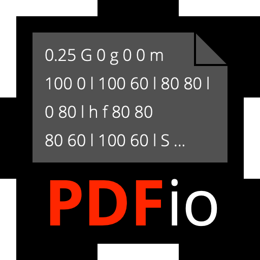
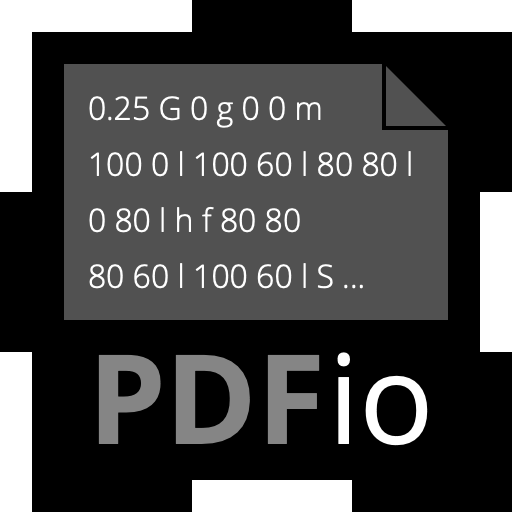
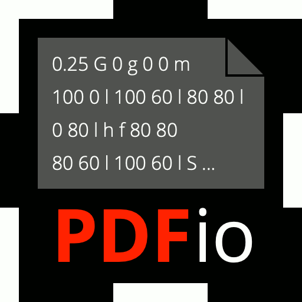

---
title: Mini-Markdown Test Document
...

All heading levels are supported from 1 to 6, using both the ATX and Setext
forms.  As an indented code block:

    # Heading 1
    ## Heading 2
    ### Heading 3
    #### Heading 4
    ##### Heading 5
    ###### Heading 6

    Setext Heading 1
    ================

    Setext Heading 2
    ----------------

As block headings:

# Heading 1
## Heading 2
### Heading 3
#### Heading 4
##### Heading 5
###### Heading 6

Setext Heading 1
================

Setext Heading 2
----------------

And block quotes:

> # BQ Heading 1
> ## BQ Heading 2
> ### BQ Heading 3
> #### BQ Heading 4
> ##### BQ Heading 5
> ###### BQ Heading 6
>
> Setext Heading 1
> ================
>
> Setext Heading 2
> ----------------

And ordered lists:

1. First item.

2. Second item.

3. Third item with very long text that wraps
   across multiple lines.

   With a secondary paragraph associated with
   the third item.

And unordered lists:

- First item.

+ Second item.

* Third item.

* [ ] Fourth item (unchecked)

- [x] Fifth item (checked)

Code block with `\``:

```
#include <stdio.h>

int main(void)
{
  puts("Hello, World!");
  return (0);
}
~~~
```

Code block with `~`:

~~~
#include <stdio.h>

int main(void)
{
  puts("Hello, World!");
  return (0);
}
```
~~~

Link to [mmd web site](https://michaelrsweet.github.io/mmd).

Normal link to [Heading 1](@).

Code link to [`Heading 2`](@).

Inner emphasized link to [*Heading 3*](@).

Outer emphasized link to *[Heading 3](@)*.

Inner strong link to [**Heading 4**](@).

Outer strong link to **[Heading 4](@)**.

Implicit link to [reference1][].

Shortcut link to [reference1] without a link title.

[reference1]: https://michaelrsweet.github.io/mmd 'MMD Home Page'

[reference2]: https://michaelrsweet.github.io/mmd/mmd.html 'MMD Documentation'

[reference3]: https://michaelrsweet.github.io/mmd/mmd-160.png "MMD Logo"

Link to [mmd web site][reference1] works.
Link to [mmd documentation][reference2] works.
Link to ![mmd logo][reference3] image.
Link to [bad reference][reference4] doesn't work.

Autolink to <https://michaelrsweet.github.io/mmd>.

Autolink in parenthesis (<https://michaelrsweet.github.io/mmd>).

[Link broken
across two lines](https://michaelrsweet.github.io/mmd)

Color JPEG Image: 
Grayscale JPEG Image: 
Color PNG Image: 
Grayscale PNG Image: 
Indexed PNG Image: 

This sentence contains *Emphasized Text*, **Bold Text**, and `Code Text` for
testing the MMD parser.  The `<mmd.h>` header file.

This sentence contains _Emphasized Text_, __Bold Text__, and
~~Strikethrough Text~~ for testing the MMD parser.

*Emphasized Text Split
Across Two Lines*

**Bold Text Split
Across Two Lines**

`Code Text Split
Across Two lines`

_Emphasized Text Split
Across Two Lines_

__Bold Text Split
Across Two Lines__

~~Strikethrough Text Split
Across Two Lines~~

All work and no play makes Johnny a dull boy.
All work and no play makes Johnny a dull boy.
All work and no play makes Johnny a dull boy.

All work and no play makes Johnny a dull boy.
All work and no play makes Johnny a dull boy.
All work and no play makes Johnny a dull boy.

\(Escaped Parenthesis)

\(*Emphasized Parenthesis*)

\(**Boldface Parenthesis**)

\(`Code Parenthesis`)

Escaped backtick (`\``)

Table as code:

    | Heading 1 | Heading 2 | Heading 3 |
    | --------- | --------- | --------- |
    | Cell 1,1  | Cell 1,2  | Cell 1,3  |
    | Cell 2,1  | Cell 2,2  | Cell 2,3  |
    | Cell 3,1  | Cell 3,2  | Cell 3,3  |

Table with leading/trailing pipes:

| Heading 1 | Heading 2 | Heading 3 |
| --------- | --------- | --------- |
| Cell 1,1  | Cell 1,2  | Cell 1,3  |
| Cell 2,1  | Cell 2,2  | Cell 2,3  |
| Cell 3,1  | Cell 3,2  | Cell 3,3  |

Table without leading/trailing pipes:

Heading 1 | Heading 2 | Heading 3
--------- | --------- | ---------
Cell 1,1  | Cell 1,2  | Cell 1,3
Cell 2,1  | Cell 2,2  | Cell 2,3
Cell 3,1  | Cell 3,2  | Cell 3,3

Table with alignment:

Left Alignment | Center Alignment | Right Alignment
:-------- | :-------: | --------:
Cell 1,1  | Cell 1,2  |        1
Cell 2,1  | Cell 2,2  |       12
Cell 3,1  | Cell 3,2  |      123

Table in block quote:

> Heading 1 | Heading 2 | Heading 3
> --------- | --------- | ---------
> Cell 1,1  | Cell 1,2  | Cell 1,3
> Cell 2,1  | Cell 2,2  | Cell 2,3
> Cell 3,1  | Cell 3,2  | Cell 3,3

# Tests for Bugs/Edge Cases

Paragraph with "|" that should not
be interpreted as a table.

    code before a bulleted list

- First item
- Second item
- Some pathological nested link and inline style features supported by
  CommonMark like "`******Really Strong Text******`".
