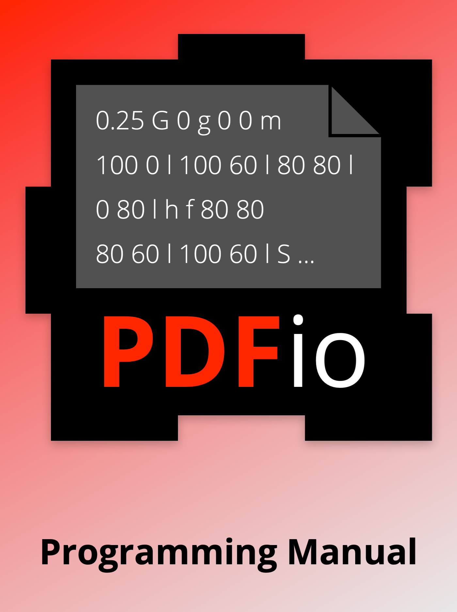

---
title: Markdown to PDF Converter Test File
...


Markdown to PDF Converter Test File
===================================

The `md2pdf` program is organized into three source files: `md2pdf.c` which
contains the code to format the markdown content and `mmd.h` and `mmd.c` (from
the [Miniature Markdown Library][MMD] project) which load the markdown content.

[MMD]: https://www.msweet.org/mmd/

This is a test file for `md2pdf`.  Here is a bullet list:

- Embed base and TrueType fonts,
- Format text with embedded JPEG and PNG images and check boxes, with support
  for wrapping, alignment in table cells, leader text (as used for lists), and
  variable line height,
- Add headers and footers, and
- Add hyperlinks and document platform.

And here is an ordered list:

1. Embed base and TrueType fonts,
2. Format text with embedded JPEG and PNG images and check boxes, with support
   for wrapping, alignment in table cells, leader text (as used for lists), and
   variable line height,
3. Add headers and footers, and
4. Add hyperlinks and document platform.


Code Blocks
-----------

```
0        1         2         3         4         5         6         7         8
12345678901234567890123456789012345678901234567890123456789012345678901234567890
```


Images
------

PDFio book cover image:




Tables
------

Table with leading/trailing pipes:

| Heading 1 | Heading 2 | Heading 3 |
| --------- | --------- | --------- |
| Cell 1,1  | Cell 1,2  | Cell 1,3  |
| Cell 2,1  | Cell 2,2  | Cell 2,3  |
| Cell 3,1  | Cell 3,2  | Cell 3,3  |

Table without leading/trailing pipes:

Heading 1 | Heading 2 | Heading 3
--------- | --------- | ---------
Cell 1,1  | Cell 1,2  | Cell 1,3
Cell 2,1  | Cell 2,2  | Cell 2,3
Cell 3,1  | Cell 3,2  | Cell 3,3

Table with alignment:

Left Alignment | Center Alignment | Right Alignment
:-------- | :-------: | --------:
Cell 1,1  | Cell 1,2  |        1
Cell 2,1  | Cell 2,2  |       12
Cell 3,1  | Cell 3,2  |      123

Table in block quote:

> Heading 1 | Heading 2 | Heading 3
> --------- | --------- | ---------
> Cell 1,1  | Cell 1,2  | Cell 1,3
> Cell 2,1  | Cell 2,2  | Cell 2,3
> Cell 3,1  | Cell 3,2  | Cell 3,3
